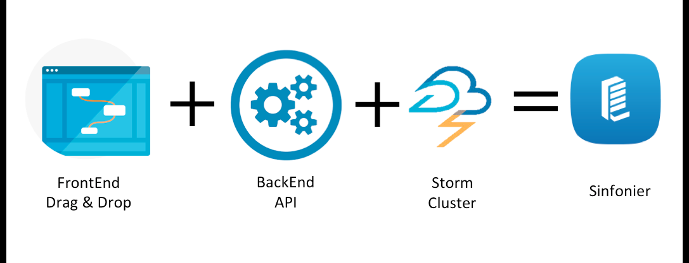
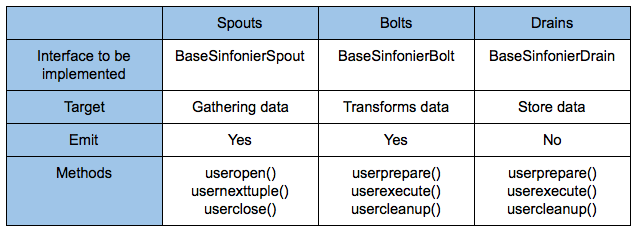

SINFONIER BACKEND
=================



Sinfoner BackEnd allow to deploy Apache Storm Topologies defined using XML into Apache Storm Cluster. It's the final step on Sinfonier Project architecture and It's used by [Sinfonier API](https://github.com/sinfonier-project/sinfonier-api)

Sinfonier BackEnd use [Apache Maven](https://maven.apache.org/) to manage Java dependencies.

## Deploy & Configure

Create folders 
```sh
/var/storm/lastjar
/var/storm/src
/var/storm/topologies
```

Change owner user
```sh
chown storm:storm lastjar/
chown storm:storm topologies/
chown storm:storm src/
```

Clone repository into /var/storm/src

    git clone https://github.com/sinfonier-project/sinfonier-backend.git

Create JAR to start deploing topologies

    <MAVEN_PATH>/bin/mvn -f /var/storm/src/sinfonier_backend/pom.xml clean compile install
    <MAVEN_PATH>/bin/mvn -f /var/storm/src/sinfonier_backend/pom.xml package

Configure in Sinfonier API this paths and start using Apache Storm in the simplest way.

## DYNAMIC TOPOLOGIES

DynamicTopology class. Reads XML configuration file in the classpath and set up the topology in a Apache Storm cluster. Also declare multilanguage static classes to use in Storm topologies.

## XML

XML contains the definition of Topology. Contains all Spouts, Bolts and Drains, all parameters associated to each module and how they are connected.

A Topology is defined when It has at least one Spout and one Drain.

```xml
<builderConfig>
    <spouts>
        <spout class='com.sinfonier.spouts.RSS' abstractionId='rss_fffccbb6' >
            <url>http://www.cvedetails.com/vulnerability-feed.php?vendor_id=0&amp;product_id=0&amp;version_id=0&amp;orderby=3&amp;cvssscoremin=0</url>
            <frequency>300</frequency>
            <parallelism>1</parallelism>
        </spout>
    </spouts>
    <bolts>
        <bolt class='com.sinfonier.bolts.Rename' abstractionId='rename_500beebb' >
            <sources>
                <source>
                    <sourceId>rss_fffccbb6</sourceId>
                    <grouping>shuffle</grouping>
                </source>
            </sources>
            <find>title</find>
            <replace>rsstitle</replace>
            <parallelism>2</parallelism>
        </bolt>
    </bolts>
    <drains>
        <drain class='com.sinfonier.drains.LogIt' abstractionId='logit_1b4152dd' >
            <sources>
                <source>
                    <sourceId>rename_500beebb</sourceId>
                    <grouping>shuffle</grouping>
                </source>
            </sources>
            <parallelism>1</parallelism>
            <entity>unknown</entity>
        </drain>
    </drains>
</builderConfig>
```

## Data Model

One of the requirements to implement a collaborative system like Sinfonier is to ensure all modules are able to communicate. For this reason Sinfonier defines a data model based on a single JSON tuple instead of Apache Storm data model based on an indeterminate number of tuples <K,V>.

This approach allow users to share and use others user’s modules into the platform and Sinfonier includes an API to manage this JSON tuple in a simple way. Allowing users to add new fields, remove fields and check fields exists. API current support Java and Python language.



## JAVA API

Spouts

```java
/**
  * Get param from module configuration file.
  */
public String getParam(String param)

/**
 * Get param from module, check if is null and if is null, throw an exception
 */
public String getParam(String param, boolean checkNotNull)

/**
 * Get list of property from module parameters configuration.
 */
public List<Object> getParamList(String param)
 
/**
 * Add field to tuple.
 */
public void addField(String key, Object value)
 
/**
 * Divide key in parts (split by '.'), access to nested documents or create them if doesn't
 * exists and finally adds the key.
 */
public void addNestedField(String key, Object value)
 
/**
 * Get field from tuple.
 */
public Object getField(String key)


/**
 * Remove a field from tuple.
 */
public void removeField(String key)


/**
 * Check if exists field corresponding to given key.
 */
public boolean existsField(String key)

/**
 * Set new Entity to tuple.
 */
public void setEntity(String entity)

/**
 * Get mapper to manage and transform to JSON.
 */
public ObjectMapper getMapper()

/**
 * Set current tuple in json raw format.
 */
public void setJson(String json)
```

Bolts and Drains

```java
/**
 * Replace current tuple by given tuple. Useful if you make deep changes in tuple.
 */
public void setJSon(Map<String, Object> json)

/**
 * Get param from module configuration file.
 */
public String getParam(String param)

/**
 * Get param from module configuration, check if is null and if is null, throw an exception.
 */
public String getParam(String param, boolean checkNotNull)

/**
 * Get list of property from xml configuration.
 */
public List<Object> getParamList(String param)

/**
 * Add field to tuple.
 */
public void addField(String key, Object value)

/**
 * Divide key in parts (split by '.'), access to nested documents or create them if doesn't
 * exists and finally adds the key.
 */
public void addNestedField(String key, Object value)

/**
 * Get field from tuple.
 */
public Object getField(String key)
 

/**
 * Remove a field from tuple.
 */
public void removeField(String key)

/**
 * Check if exists field corresponding to given key.
 */
public boolean existsField(String key)

/**
 * Get current tuple in a {@link java.util.Map}.
 */
public Map<String, Object> getJson()

/**
 * Current tuple in raw string json.
 */
public String getRawJson()

/**
 * Set name of entity tuple to emit to the next component.
 */
public void setEntity(String name)

/**
 * Retrieve entity name.
 */
public String getEntity() 
```

## PYTHON API

## Project leads

* Francisco J. Gomez @ffranz https://github.com/ffr4nz/
* Alberto J. Sanchez @ajsanchezsanz https://github.com/ajsanchezsanz

## Committers

* Gaspar Muñoz gmunoz at stratio dot com

## Contributors

## License

Apache License, Version 2.0: http://www.apache.org/licenses/LICENSE-2.0